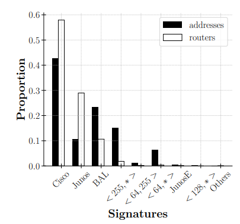

### Fingerprinting

Fingerprinting rutera se odnosi na tehniku identifikacije i prikupljanja informacija o ruteru na osnovu njegovih jedinstvenih karakteristika i ponašanja. Iako je glavni cilj fingerprintinga rutera često poboljšanje bezbednosti mreže, postoji i rizik da napadač dođe do tih informacija i da njih iskoristi. Ako napadač identifikuje marke rutera i cilja određene proizvođače sa poznatim sigurnosnim propustima, može doći do zloupotrebe, pogotovo ako je reč o verzijama firmware-a koji imaju poznate propuste koji su lako iskoristivi.

Tabela 1 sumira glavne potpise rutera, sa povezanim brendovima rutera i operativnim sistemima rutera.

*Šta bi se moglo desiti ako napadač lako može identifikovati brendove rutera i ciljati određenog dobavljača s poznatim bezbednosnim propustima?* Ovo pitanje je motivisano nedavnim otkrićem pet ranjivosti u različitim Cisco uređajima (četiri od njih dovode do ranjivosti na izvršavanje udaljenog koda, a jedna do ranjivosti [DoS](https://github.com/n-vojin/Zastita-tim7/blob/main/DoS%20Napad.md)), kao i otkrićem Bleichenbacher oracle-a(tj. adaptivni napad izbora šifrovanog teksta protiv nekih protokola zasnovanih na RSA) u implementacijama IKEv1 kod četiri velika proizvođača mrežne opreme (Cisco, Huawei, Clavister i ZyXEL). Ovi napadi nisu ograničeni na nekoliko rasutih uređaja, već mogu uticati na mnogo različitih modela hardvera za svakog proizvođača, s obzirom da su ranjivosti pronađene u softveru zajedničkom za mnoge različite proizvode. \[1\]

### Fingerprinting u svrhe istrazivanja

Korišćenjem više različitih tehnologija istraživači su uspeli da ispitaju koji su to ruteri, od kojih proizvođača i sa kakvim operativnim sistemima, su najrasprostranjeniji kod korisnika u SAD-u. Došli su do sledećih podataka:

Iskorišćavanjem metoda fingerprinting-a, možemo proučiti raspodelu hardvera u mreži. Slika prikazuje globalnu distribuciju potpisa kako za adrese, tako i za rutere na internetu. Što se adresa tiče, primetno je da su Cisco potpisi dominantni, sa više od 40% adresa u toj klasi. Druga najvažnija klasa je BAL klasa (tj. Brocade, Alcatel i Linux mašine) sa oko 25% adresa. Nakon toga, sa udelom od 15% adresa, dolazi potpis &lt; 255, ∗ &gt;.  \[1\]

Naravno do ovih informacija mogu da dođu i zlonamerni korisnici, korišćenem sličnih metoda, isto tako mogu da ih zloupotrebe ako gađaju poznate slabe tačke kod rutera određenih proizvođača.

### Alati za fingerprinting

Postoje razni alati koji su poznati i mogu da omoguće prikupljanje bitnih informacija za rutere. Neki od njih su:

**Nmap:** Nmap je open-source alat za skeniranje i izviđanje mreže koji može izvršavati fingerprinting operativnog sistema. Šalje seriju ICMP echo zahteva, UDP paketa i TCP proba sa različitim vrednostima polja, zastavica i opcija kako bi identifikovao udaljeni sistem. Proučavanjem odgovora, kao što su dužina, opcije, veličina prozora, brojevi sekvenca, IP ID i TTL vrednosti, kontrolni zbir, i zastavice, Nmap pronalazi najbolje podudaranje implementacije u svojoj bazi podataka otisaka operativnog sistema. Najnovija verzija Nmap-a (7.91) sadrži 5.679 otisaka; od tih, približno 160 i 22 odnose se na Cisco i Juniper rutere, redom. Iako je Nmap moćan alat za TCP/IP fingerprinting, zahteva da udaljeni domaćin sluša i odgovara na otvorenom TCP portu. Zbog toga što su rutere u divljini obezbeđeni i obično ne odgovaraju na neželjene TCP probe, Nmap je generalno neefikasan za fingerprinting rutera \[2\].

**MIDAR** proširuje nedavne radove u vezi sa razrešavanjem aliasa zasnovanim na IP ID-ju novim, visoko skalabilnim tehnikama koje minimiziraju lažne pozitivne rezultate dovoljno da postignu visoku pozitivnu prediktivnu vrednost na internetu (tj. milioni adresa). \[3\]

### Mitigacije rizika

Najveću ulogu u mitigaciji bi trebali da preduzmu sami proizvođači rutera i operateri.

Operateri mreže mogu se zaštititi od fingerprinting-a i svih njegovih potencijalnih bezbednosnih implikacija na različite načine. Prvi način je izuzetno jednostavan: koristite standardni početni TTL (iTTL) u ICMP paketima, kako preporučuje RFC1700 \[4\]. Pošto iTTL nije konfigurabilan od strane operatera, ova preporuka je upućena proizvođačima hardvera koji moraju anonimizovati svoje rutere tako što će se pobrinuti da svaki paket bude fordiran sa istim iTTL.

Složenija tehnika je obfuskacija topologije kako bi se sprečilo otkrivanje potencijalnih ciljeva od strane napadača. Primer bi bio prilagoditi, na primer, NetHide za obfusciranje veza, ali i anonimizaciju rutera

Konačno, kao poslednje sredstvo, operater može odlučiti da potpuno isključi ICMP pakete (ili barem da ih filtrira na rubu, kao što se radi sa IGMP), čime efikasno skriva topologiju i hardversku infrastrukturu. Međutim, ovo rešenje donosi više nedostataka nego prednosti i često se smatra potpuno nepraktičnim, s obzirom da su traceroute i ping esencijalni alati za otklanjanje problema u mreži (poruke o greškama, provera povezanosti, PMTU otkrivanje, ...). Osim toga, situacija je još gora za IPv6, gde se ICMPv6 ne može tretirati kao pomoćna funkcija, kao što je to slučaj sa njegovim IPv4 pandanom, gde se paketi u većini slučajeva mogu odbaciti bez narušavanja funkcionalnosti mreže \[1\].

&nbsp;

## Reference

\[1\] [Network Fingerprinting: Routers under Attack - Emeline Marechal Montefiore, Benoit Donnet](https://orbi.uliege.be/bitstream/2268/248733/1/paper.pdf)

\[2\] [Third Time's Not a Charm: Exploiting SNMPv3 for Router Fingerprinting](https://dl.acm.org/doi/pdf/10.1145/3487552.3487848)

\[3\] [Internet-Scale IPv4 Alias Resolution With MIDAR.](https://sci-hub.se/10.1109/tnet.2012.2198887)

\[4\] [“Assigned numbers,” Internet Engineering Task Force, RFC 1700](https://datatracker.ietf.org/doc/html/rfc1700)
