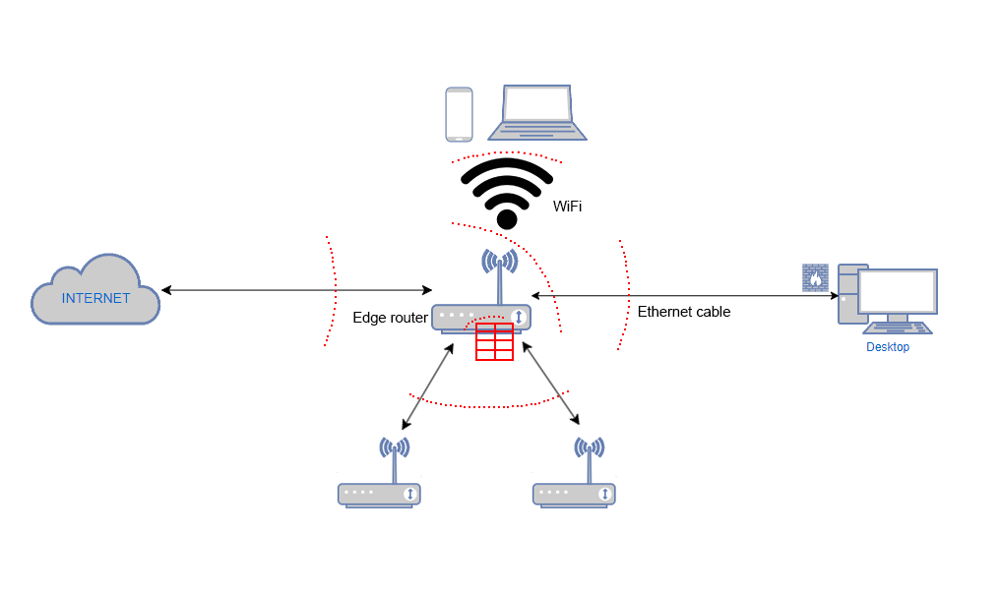

## Model rutera

Ruter je uređaj koji povezuje dvije ili više mreža. Ruteri vode i usmjeravaju mrežne podatke koristeći pakete. Paketi podataka imaju nekoliko slojeva, ili sekcija, od kojih jedan nosi identifikacione informacije kao što su pošiljalac, tip podataka, veličina i odredišna IP adresa. Ruter čita ovaj sloj, daje prioritet podacima i bira najbolju rutu za svaki prenos.

Samim tim se nadovezuje i sam razlog napada na ruter kao jednog od najvažnijih uređaja na mreži. Ruteri mogu da čuvaju identitet saobraćaja podataka na osnovu tabela dostupnih preko rutera. Brzi napredak tehnologije rutera dokazuje da su ruteri najpotrebniji uređaji, posebno za internet provajdere i njihove bezbjednosti. Glavni cilj napadača prije ulaska u glavni sistem ili centar podataka je da isključi performanse rutera [1].

## Tipovi rutera

**Core router**
Core rutere uglavnom koriste servisni ili cloud dobavljači. Oni pružaju maksimalnu propusnost za povezivanje dodatnih rutera. Većini malih preduzeća neće biti potrebni osnovni ruteri. Ali veoma velika preduzeća koja imaju mnogo zaposlenih koji rade u različitim zgradama ili na različitim lokacijama mogu koristiti osnovne rutere kao dio svoje mrežne arhitekture.

**Edge ruter**
Edge ruter se takođe naziva ruter mrežnog prolaza (gateway), je najudaljenija tačka mreže za povezivanje sa spoljnim mrežama, uključujući Internet. Edge ruteri su optimizovani za propusni opseg i dizajnirani da se povežu sa drugim ruterima kako bi distribuirali podatke krajnjim korisnicima.

**Distribucijski ruter**
Distribucioni ruter, ili unutrašnji ruter, prima podatke sa gateway-a preko žičane veze i šalje ih krajnjim korisnicima, obično preko interneta, iako ruter obično uključuje i fizičke (Eternet) veze za povezivanje korisnika ili dodatni ruteri.

**Bežični ruter**
Bežični ruteri ili stambeni mrežni prolazi, kombinuju funkcije Edge rutera i distributivnih rutera. Ovo su uobičajeni ruteri za kućne mreže i pristup Internetu.

**Virtuelni ruter**
Virtuelni ruteri su dijelovi softvera koji omogućavaju da neke funkcije rutera budu virtuelizovane u Cloud-u i isporučene kao usluga. Ovi ruteri su idealni za velika preduzeća sa složenim mrežnim potrebama. Oni nude fleksibilnost, laku skalabilnost i niže troškove. Još jedna prednost virtuelnih rutera je smanjeno upravljanje hardverom lokalne mreže [2].

## Funkcionalnosti rutera

Uloga rutera se ogleda u nekoliko tačaka:

1. Povezivanje uređaja unutar mreže i dijeljenje resurasa, podataka i usluga i time omogućava međusobnu komunikaciju.

2. Informacije koje se dijele, stavljaju se u pakete i kruže mrežom, ruteri analiziraju pakete i pronalaze najefikasniji put.

3. Ruteri mogu da daju prioritet određenim vrstama saobraćaja, obezbjeđujući da kritične aplikacije (kao što su glas ili video) dobiju veći prioritet, što rezultuje poboljšanim performansama za aplikacije osjetljive na vrijeme.

4. Ruteri dodjeljuju i upravljaju IP adresama za uređaje unutar mreže. Ovo je ključno za identifikaciju i usmjeravanje podataka na tačno odredište. Mogu uključiti DHCP servere, koji automatski dodjeljuju IP adrese uređajima na mreži, pojednostavljujući konfiguraciju mreže za korisnike.

5. Ruteri su neophodni za povezivanje lokalnih mreža na internet. Oni deluju kao mrežni prolaz, prosleđujući podatke između uređaja na lokalnoj mreži i šireg interneta.

6. Ruteri omogućavaju stvaranje podmreža, dijele veću mrežu na manje segmente. Ova segmentacija poboljšava performanse mreže, bezbednost i upravljanje.

## Model granica povjerenja

Proučavajući napade, izdvajaju se pet tačaka koje napadači najčešće koriste za pristup ruteru u cilju njihovog napada:

1.  Povezica rutera za sam Internet
2.  Uređaji koji su povezani preko WiFi-a
3.  Uređaji koji su povezani preko fizičkog kabla
4.  Sama mreža rutera
5.  Ruter tabela

Dijelovi rutera, ranjivosti koje su ispitane, opisi napada i njihove mitigacije su opisane u pojedinačnim napadima unutar foldera <a href="./Napadi i odbrane">**Napadi i odbrane**</a>.

## Reference

[1] [Yudhana,A.,Riadi,I.,& Ridho, F. (2018). DDoS Classification Using Neural Network and Naïve Bayes Methods for Network Forensics. International Journal of Advanced Computer Science and Applications(IJACSA),9(11), 177-183.DOI:](https://thesai.org/Publications/ViewPaper?Volume=9&Issue=11&Code=ijacsa&SerialNo=25)

[2] [What is a Router?](https://www.cisco.com/c/en/us/solutions/small-business/resource-center/networking/what-is-a-router.html)
