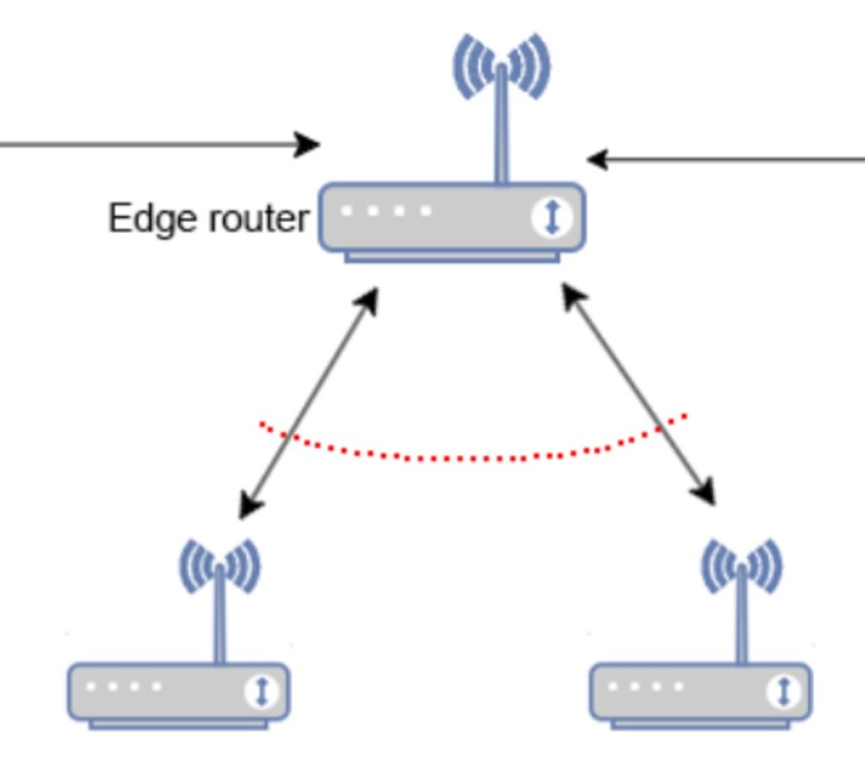
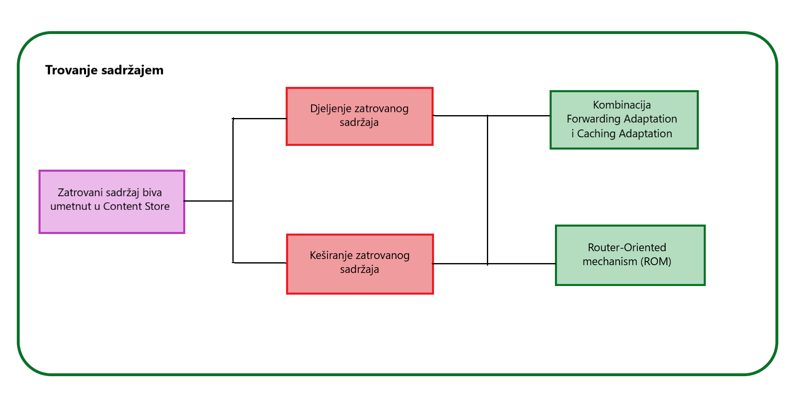
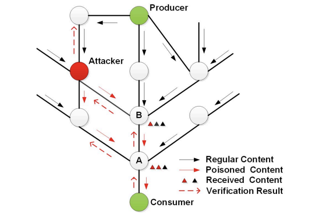
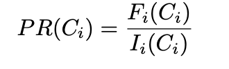
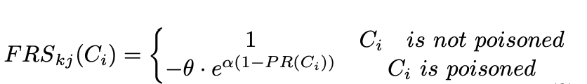
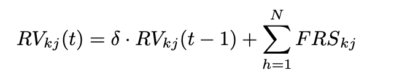

# Trovanje sadržajem

Postojeća Internet arhitektura se oslanja na IP adrese za usmjeravanje prenosa paketa. Ova arhitektura postepeno usporava i otežava sam protok saobraća jer mrežne usluge i aplikacije danas postaju mobilne i fokusirane na podatke. Kao prijedlog za poboljšanje Internet arhitekture zasnovane na IP-u, uvodi se Named Data Networking (NDN). NDN je novi dizajn arhitekture, koji ima za cilj da premosti jaz između postojeće arhitekture zasnovane na IP-u i aplikacija usredsređenih na sadržaj, tako što se sadržaj prosljeđuje na osnovu njegovog imena umjesto njegove odredišne IP adrese [1].

## Granice povjerenja

 

## Sadržaj rutera

Sadržaj rutera se posmatra kao paket. Paketi igraju ključnu ulogu u komunikacijskom modelu NDN-a. Obrađuju se i šalju dva tipa paketa:

1.  **Interests paketi**
    Ovi paketi u svojoj strukturi uključuje naziv željenog sadržaja. Kada potrošač želi da preuzme određeni dio sadržaja, on šalje Interests paket u mrežu. Ovaj paket sadrži naziv sadržaja koji potrošač traži. Interests paket se prosljeđuje skok po skok kroz mrežu ka izvoru sadržaja.
2.  **Paketi podataka**
    Paketi podataka u NDN-u uključuju traženi sadržaj zajedno sa metapodacima, a potpisuje ih proizvođač sadržaja. Kada ruter duž putanje Interests paketa ima traženi sadržaj u svom skladištu sadržaja (keš memorija), on odgovara slanjem paketa podataka nazad ka potrošaču. Ovaj paket podataka sadrži traženi sadržaj i prati obrnuti put od Interests paketa prema potrošaču.

Kako izgleda niz generisanja paketa:

1.  Potrošač generiše Interests paket za određeni dio sadržaja tako što navede ime sadržaja.
2.  Interests paket se šalje u mrežu i prosljeđuje skok po skok ka izvoru sadržaja.
3.  Ruteri koriste svoje strategije prosljeđivanja da bi odredili kako da proslijede Interests paket.
4.  Kada Interests paket stigne do rutera koji ima traženi sadržaj u skladištu sadržaja, taj ruter generiše paket podataka.
5.  Paket podataka se šalje nazad ka potrošaču, prateći obrnuti put od Interests paketa.
6.  Srednji ruteri duž obrnute putanje koriste svoje strategije prosleđivanja da bi odredili kako da proslijede paket podataka.

Ovaj pristup je usredsređen na sadržaj i omogućava ruterima u NDN mrežama da dinamički preuzimaju i prosljeđuju sadržaj na osnovu interesovanja potrošača, pružajući fleksibilniji i efikasniji način upravljanja i distribucije podataka. Upotreba imena za sadržaj omogućava ruterima da se fokusiraju na sam sadržaj, a ne na specifične lokacije ili adrese hostova.

## Ranjivosti

Dizajn arhitekture zasnovane na IP-u otvara vrata za nove bezbjednosne propuste. Jedan od takvih jeste NDN zahtev da svaki sadržaj (zajedno sa njegovim imenom) bude kriptografski potpisan od strane proizvođača sadržaja, a potrošač sadržaja treba da verifikuje svaki primljeni sadržaj. Međutim, NDN ne nalaže ruterima da verifikuju sadržaj zbog različitih problema kao što su troškovi. Pošto će NDN ruteri keširati sadržaj i koristiti ga za zadovoljavanje narednih zahtjeva, zatrovani sadržaj (tj. oštećeni sadržaj ili lažiran od strane napadača) će biti keširan u ruterima duž putanje prenosa i na kraju propagiran do potrošača [1].

Iako potrošači mogu da otkriju takav zatrovan sadržaj i ponovo izdaju zahtjeve, bez odgovarajućih mehanizama, oni mogu nastaviti da primaju zatrovani sadržaj, jer:

1.  zatrovani sadržaj se kešuje u ruterima duž putanje prenosa
2.  zlonamjerni ruter na putu prenosa stalno truje sadržaj koji prolazi.
    Ovo je poznato kao napad trovanja sadržajem [1].

## Stablo napada

 

## Opis napada

Da bi napad bio sproveden, zatrovani sadržaj može biti umetnut u Content Store (CT) korišćenjem kompromitovanih rutera. CT je lokalni keš koji igra ulogu u efikasnom preuzimanju i privremenom čuvanju sadržaj koji je nedavno zahtjevan ili prenijet. Postoji nekoliko načina kako CT može biti "zatrovan":

1.  Slanjem lažnih paketa podataka sa netačnim sadržajem
2.  U NDN-u, ruteri koriste Interests za traženje podataka. Interests se koristi za izražavanje zahteva određenih imenovanih podataka, a imena koja se koriste su hijerarhijska i strukturirana, nalik na konvenciji o imenovanju. Napadač može da preplavi mrežu velikim brojem lažnih Interests-a za nepostojeće podatke, preplavi rutere i natera ih da keširaju nepotrebne ili netačne podatke.
3.  Napadači mogu namjerno zahtjevati popularan sadržaj više puta, što dovodi do toga da ruteri stalno keširaju isti sadržaj. Ovo može dovesti do zagađenja keša, gde se keš puni suvišnim kopijama istih podataka.
4.  Ako skladište sadržaja nije adekvatno obezbjeđeno, napadač može direktno da izmijeni keširane podatke.
5.  Napadači mogu pokušati da manipulišu politikama zamijene keša kako bi favorizovali određene vrste sadržaja, što bi potencijalno dovelo do izbacivanja legitimnih podataka u korist zlonamjernog ili nepoželjnog sadržaja.

Jedna od jakih prednosti NDN-a je to što svi čvorovi koji imaju kopije sadržaja mogu poslužiti korisničkim zahtevima, ali to takođe implicira da se saobraćaj napadača može sa lakoćom ubrizgati u mrežu. Pošto verifikacija nije obavezna za rutere zbog velikih troškova, zatrovani sadržaj se tokom transporta smješta u pomenuti CS međurutera. Jednom kada se zatrovani sadržaj pojavi u CS-u. može mu se pristupiti budućim zahtjevima na osnovu jednostavnog podudaranja imena i lako se distribuirati preko mreže. Zatrovani sadržaj gubi ograničen prostor na CS. Pored toga, ometa korisnike da jednim pokušajem dođu do validnog sadržaja. Ako korisnik ne uspije da potvrdi primljeni otrovani sadržaj, on ili ona ponovo izdaje Interest koji ima heš vrijednost primljenog zatrovanog sadržaja u polju Isključi. Ruteri bi služili Interest sa keširanim sadržajem koji ima različite heš vrijednosti ili bi prosljedio Interest na sledeći skok. Ovaj proces dovodi do dodatnog kašnjenja pristupa i provjeravanja heša na ruterima [2].

## Posljedice

Posljedice koje mogu nastati trovanjem sadržaja su:

- **Dezinformacije i problemi sa poverenjem**
  Trovanje sadržajem može dovesti do širenja lažnih informacija. Ovo može dovesti do toga da korisnici donose odluke na osnovu netačnih podataka, narušavajući povjerenje u mreži.
- **Finansijski gubitak**
  Napadi trovanja sadržajem mogu se koristiti za finansijske prevare, kao što je promjena bankarskih ili finansijskih informacija. To može dovesti do finansijskih gubitaka za pojedince ili organizacije koje se oslanjaju na ugroženi sadržaj.
- **Kompromitovan integritet mreže**
  Integritet cijele mreže može biti ugrožen ako se kritični sadržaj, kao što su informacije o rutiranju, zatruje. Ovo može dovesti do nestabilnosti mreže, preusmjeravanja saobraćaja ili neovlašćenog pristupa.
- **Gubitak poverljivih informacija**
  Napadi trovanja sadržajem mogu biti usmjereni na povjerljive informacije koje se čuvaju ili prenose putem mreže. Ovo može dovesti do izlaganja osjetljivih podataka, poslovnih tajni ili vlasničkih informacija.

## Mitigacija

U ovoj sekciji predstaviće se dvije mitigacije:

1.  Kombinacija Forwarding Adaptation i Caching Adaptation
2.  Router-Oriented mechanism (ROM)

<h4> Kombinacija Forwarding Adaptation i Caching Adaptation <h4>

Osnovni cilj sistema je da bude u stanju otkriti izvor sadržaja koji je napadnut i da zauzvrat ublaži napad izbjegavanjem interakcije sa odgovarajućim izvorom. U tu svrhu uvodimo metriku „Notorieti“, koja se definiše kao odnos broja otrovnih primljenih objekata sadržaja u odnosu na ukupno primljene objekte sadržaja. Dakle, vrijednost Notorieti ukazuje na proporciju otrovnog sadržaja.

Takođe, uvodi se „vjerovatnoća prosljeđivanja“ (Forwarding Probability FP), koja se vezuje za vrijednost Notorieti-a.

FP se izračunava kao: FP = 100 − Notorieti

Prema tome, što je veća vrijednost Notoritet-a, to je niža vjerovatnoća prosljeđivanja. FP se može izračunati ili na kraju mreže korisnika (rubni ruter) ili preko njegovih susjednih pristupnih rutera, kako bi se iskoristio za ograničavanje protoka Interest-a koji zahtjevaju potencijalno otrovan sadržaj.

Prilikom svakog izdavanja Interest-a, potrošač (ili rubni ruter) generiše nasumični broj (r) koji treba da bude veći od FP određenog prostora imena, Interest-a, da bi proslijedio Interest u jezgro mreže. U obrnutom slučaju, problematični Interest se odbacuje i postupak se ponavlja za sledeći izabrani prostor imena.

Forwarding Adaptation se ponaša proaktivno jer ograničava protok otrovnog sadržaja izbjegavanjem prosljeđivanja Interest-a za ozloglašene prostore imena. Stoga, prilagođavanje prosljeđivanja obezbjeđuje zaštitu od trovanja sadržajem indirektno, utičući na šanse zlonamjernog izvora da dobije Interest i odgovori otrovnim sadržajem koji se može keširati.

Caching Adaptation ima za cilj da zaštiti keš rutera na putu, odnosno njihovu slabu tačku. U ovom slučaju, ruteri treba da nadgledaju sadržaj koji prolazi kroz njih i da prate povezane prostore imena i povremeno komuniciraju sa potrošačima da bi dohvatili povezane vrijednosti Notoriteta. Važno je napomenuti da ruteri preuzimaju jedan izvještaj po imenskom prostoru uključujući izračunatu vrednost Notorie-a. Ovo se dešava periodično kako bi ruteri postali svjesni najnovijih vriednosti Notorieti-a. Slično 'Forwarding Adaptation', svaki ruter definiše 'Cache Probabiliti' (CP) za svaki prefiks koji se povećava kako se vrijednost ozloglašenosti smanjuje:
CP = 100 − Notorieti
Štaviše, ovog puta ruter izračunava slučajnu vrednost r, koji se poredi sa CP i odlukom o keširanju je napravljen u skladu s pravilom ako je CP manji od r, onda se sadržaj kešira, ako je veći, sadržaj se odbacuje [3].

<h4> Router-Oriented mechanism (ROM) <h4>

ROM je mehanizam orijentisan na ruter koji može da ublaži napad trovanja sadržaja u NDN-u. ROM štiti sadržaj od zlonamjernih rutera tako što ih privremeno isključuje sa putanje prenosa, tako da je malo vjerovatno da će sadržaj biti otrovan tokom prenosa. Pošto je lokalizacija zlonamjernih rutera teška u NDN-u, uvodi se nova vrijednost reputacije da bi se kvantifikovao stepen pouzdanosti rutera. Vrijednost reputacije je moguće izračunati na osnovu dva ključna zapažanja za NDN:

1. Ruter koji je daleko od napadača trebalo bi da ima malu vjerovatnoću da bude zlonamjerni ruter, i suprotno.
2. Kako će se zatrovani sadržaj širiti na više puteva, ruteri koji su udaljeni od napadača bi trebalo da dobiju više kopija zatrovanog sadržaja u poređenju sa ruterima koji su blizu napadača

Prateći gore pomenuta zapažanja, kvantifikuje se vrijednost reputacije rutera procjenom broja zatrovanih kopija primljenih za određeni sadržaj. Pored toga, vremenom se prilagođava vrijednost reputacije rutera. Ruter sa „lošom reputacijom“ može da postane dobar ako ne vrši zlonamjerno ponašanje tokom određenog perioda; ruter sa „dobrom reputacijom“ će postati loš ako se ponaša zlonamjerno. Konačno, dizajnira se novi distribuirani protokol za ažuriranje vrijednosti reputacije asinhrono sa prenosom sadržaja.

Kako se može izmjeriti reputaciju susjednog rutera? Intuitivno, ruter koji je bliži napadaču će imati veću vjerovatnoću da bude zlonamjerni ruter. Pošto je ovaj ruter manje vjerovatno pošten, trebalo bi da ima malu vrijednost reputacije. Slično tome, ruter koji je daleko od napadača imaće malu vjerovatnoću da bude zlonamjerni ruter, a trebalo bi da ima veliku reputaciju, jer je vjerovatnije da je pošten.

Kako se može znati da li je zlonamjerni rutera blizu napadača i kako se može kvantifikovati ova udaljenost? U NDN-u, sadržaj (uključujući zatrovani sadržaj) se prosleđuje sa više putanja. Drugim riječima, ako mnogo susjednih rutera primi isti dio zatrovanog sadržaja, ovaj zatrovani sadržaj je trebalo da bude široko rasprostranjen i zlonamjerni ruter koji je zatrovao sadržaj trebalo bi da bude daleko. Daje se konkretan primjer na slici ispod.

Napadač je falsifikovao dio sadržaja i iskoristio ga da zadovolji zahtjeve koje su poslali potrošači. Pošto je napadač udaljen od rutera A, ovaj falsifikovani sadržaj će se širiti prije nego što stigne do rutera A. Kao što je prikazano na slici, ruter A je primio dvije kopije falsifikovanog sadržaja. Naprotiv, ruter B je primio samo jednu kopiju falsifikovanog sadržaja, pošto je bliži napadaču. Ovo zapažanje omogućava kvantifikaciju udaljenosti između datog rutera i zlonamjernog rutera korišćenjem broja zatrovanog sadržaja koji se prima za određeni sadržaj.
Za potrebe ROM mehanizma uvode se tri parametra:

1.  Odnos trovanja
2.  Rezultat povratne reputacije
3.  Vrijednost reputacije

**Odnos trovanja (Poisoning ratio PR)**
Uvodimo se da bi označili procenat zatrovanih kopija primljenih za određeni sadržaj, gdje se računa kao proporcija broja zatrovanih skupova paketa sadržaja koje prosljeđuju ruteri i ukupnog broja kopija primljenih paketa. Vrijednost PR se na neki način može koristiti za određivanje udaljenosti između rutera i napadača. Velika PR vrijednost implicira veliku vjerovatnoću da je ruter udaljen od napadača i da je stoga manje vjerovatno da je zlonamjeran. Mala PR vrijednost implicira veliku mogućnost da je ruter u blizini napadača, pa je vjerovatnije da je zlonamjeran. Formula po kojoj se PR računa prikazana je ispod.

**Rezultat povratne reputacije (Feedback reputation score FRS)**
Ovdje se postavlja pitanje kako da se kazne ruteri prema njihovoj relevantnosti (uhvaćenoj u PR vrijednosti) kod napadača. FRS predstavlja jačinu kazne rutera koji su prosljeđivali otrovane sadržaje. Ako ruter prosleđuje zatrovan sadržaj, njegovoj reputaciji će biti dodat odgovarajući negativni FRS kako bi se spriječio ponovno prosleđivanje zatrovanog sadržaja. Ažuriranje FRS će pratiti princip „linearnog povećanja, eksponencijalnog smanjenja“, drugim rečima, značajno se smanjuje reputacija sumnjivog susjednog rutera i polako povratiti njegovu reputaciju ako kasnije ne proslijedi zatrovan sadržaj. Konkretno, FRS se može izračunatiprema formuli na slici ispod.

Ci predstavlja sadržaj rutera j koji se prosljeđuje ruteru k. θ je faktor kazne. Veći θ ukazuje na ozbiljniju kaznu koja se primjenjuje na ruter j. α je parametar prilagođavanja kojim se podešava intenzitet kazne.

**Vrijednost reputacije (Reputation value RV)**
Vrijednost reputacije je kontramjera, koja se oslanja na reputaciju susjednih rutera, na osnovu koje ruter može da odredi da li treba da preuzme sadržaj od ovih susjeda. Da bi procijenili koliko povjerenja može da ima susjedni ruter, akumuliraju se povratni rezultati reputacije, izračunavajući vrednost reputacije. Vrijednost reputacije od rutera k do njegovog susednog rutera j može se izračunati formulom na slici ispod.

N predstavlja sadržaj koji dolazi od rutera j do rutera k u vremenskom intervalu [t − 1, t] i t ≥ 1.
h ∈ [1, N] označava rezultate verifikacije sadržaja koji prolaze kroz ovaj ruter u ovom vremenskom intervalu . Vrijednost reputacije RV u trenutku t može se izračunati korišćenjem RV vriednosti u vremenu t−1 koja se pomnoži sa faktorom opadanja vremena d, te se doda akumulacija FRS dobijena unutar [t − 1, t].

**Četiri faze ROM mehanizma**
Prema rezultatima provjere sadržaja od strane potrošača, ruteri na putu prenosa mogu izračunati odnos trovanja sadržaja i reputaciju povratne informacije. Pored toga, ruteri ažuriraju vrijednosti reputacije gornjih rutera sa kojih se prosljeđuje ovaj sadržaj koji izaziva trovanje. Na ovaj način, kada ruter treba da proslijedi određeni Interest, on može izabrati poštene susjedne rutere kao sljedeći skok za prosleđivanje ovog paketa.

ROM uključuje četiri faze:

1. Potrošač šalje mreži Interest za sadržaj, a ruter u prvom skoku prosljeđuje ovo "interesovanje" nekim od svojih pouzdanih susjeda zasnovanog na RV.
2. Ako je dio ciljnog sadržaja prosljeđen sa rutera ili proizvođača na ruter, ovaj ruter skladišti heš i interfejs sadržaja kao odgovarajući unos u tabeli sa kamatom na čekanju, te odlaže brisanje ovog unosa. Više dijelova traženog sadržaja će biti vraćeno, a prethodno pomenuti parovi za ove dijelove sadržaja će biti snimljeni. Pored toga, svi su potpisani korišćenjem javnog ključa proizvođača.
3. Nakon što komad sadržaja stigne do potrošača, potrošač autentifikuje sadržaj, odnosno izvršava proces verifikacije potpisa. Jednom kada dobije negativan rezultat verifikacije, ovaj potrošač će poslati ovaj negativni rezultat verifikacije i heš sadržaja nazad uzvodnim ruterima duž istog puta prenosa.
4. Nakon što ruter primi verifikacioni rezultat i heš od potrošača, on upoređuje heš sa svim sačuvanim heševima kako bi izbrojio broj istih zlonamjernih dijelova. Na ovaj način, kažnjava susjeda koji je poslao ovaj maliciozni komad, ruter će izračunati PR i FRS, te ažurirati trenutnu vrednost reputacije RV.

Dobijeni dizajn, ROM, može da se odbrani od napada trovanja sadržajem i da obezbijedi siguran prenos čak i kada su ruteri zlonamjerni, jer ROM može da obezbijedi da će se sadržaj prenijeti duž rutera za koje je malo vjerovatno da će izvesti zlonamjerno ponašanje. Pored toga, ROM je veoma efikasan jer se ne oslanja na verifikaciju u mreži [1].

## Reference

[1] [Danye Wu, Zhiwei Xu, Bo Chen , Yujun Zhang. What If Routers Are Malicious? Mitigating Content Poisoning Attack in NDN](https://sci-hub.se/10.1109/trustcom.2016.0100)

[2] [Luqmanul M. An Overview of Content Poisoning in NDN: Attacks, Countermeasures, and Direction](https://koreascience.kr/article/JAKO202022762159500.page)

[3] [Ioanna Angeliki Kapetanidou, John Burke. Avoiding Notorious Content Sources: A Content-Poisoning Attack Mitigation Approach](https://www.techtarget.com/searchnetworking/definition/domain-name-system)
