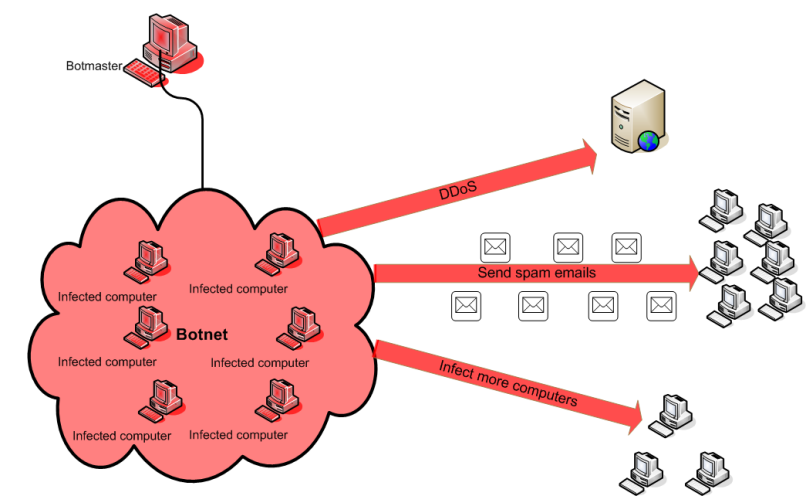

# DoS

### Pretnja

Kako je ruter zadužen za protok svih informacija koje se razmenjuju između LAN-a i WAN-a, on predstavlja atraktivnu metu za napade DoS vrste. Pogotovo zato što se lako može "prepalaviti" zahtevima. Potencijalni napadači mogu da to iskoriste i onemgouće ili znatno uspore protoke podataka kod krajnjih korisnika, kod kućnih mreža to možda ne bi prouzrokovalo neku veliku štetu, ali u mrežama koje koriste preduzeća, koja zavise od protoka velike količine informacija, bi se itekako mogla napraviti velika šteta. Napadač bi znatno usporio ili čak onemogućio preduzeću da pruža svoje usluge, što bi dovelo do velikih gubitaka.

Potencijalni napadači su: konkurenta firma, zlonamerni ili nezadovoljni korisnici, kojima je u cilju da uspore, otežaju ili onemoguće rad mreže, ili ucenjivači koji bi tražili neku naknadu kako bi prestali sa napadom DoS vrste.

### Šta predstavlja DoS napad?

Napad uskraćivanja usluge (DoS) predstavlja pokušaj da se usluga učini nedostupnom; ta usluga može biti veb ili mejl server, uređaj za rutiranje, server sistema za upravljanje domenskim imenima (DNS), ili neki drugi tip servera. Napadač može efikasno onemogućiti uslugu konzumiranjem resursa ciljnog sistema, kao što su propusnost ili procesorski resursi. Pošto računari koji pružaju ovu uslugu mogu imati visoke performanse, napadaču je potrebno da kontroliše veliki skup računarskih resursa, procesorske moći i propusnosti. Ovo se može prevazići korišćenjem distribuiranog računanja i botneta. Kontrolišući stotine hiljada botova, propusnost može biti veoma velika, omogućavajući botnetu da konzumira većinu računarskih resursa usluge, čime je čini nedostupnom. \[1\]

Botnet se može koristiti u razne zlonamerne svrhe, uključujući i DDoS, koji je zapravo distribuirani DoS napad.

### Ograničeni resursi i nedostatak zaštitnog softvera.

Ruter je fizički mali uređaj s ograničenim resursima. To otežava dodavanje softvera za zaštitu poput antivirusa ili antimalvera. Ograničenja u resursima čine uređaj ranjivim na napade uskraćivanja usluge (DoS ili DDoS), jer se resursi lako mogu "popuniti" zahtevima. Istovremeno, ruter obično već podržava mnoge usluge, ostavljajući malo neiskorišćenih resursa i čineći instalaciju sistema za otkrivanje upada (Intrusion Detection Systems) vrlo teškim.

### Mitigacije

Moderni ruteri danas imaju instalirane sisteme za detektovanje i sprečavanje DoS napada na proces rutiranja, koji su brute-force vrste, ali postoje i napadi druge vrste  **Low rate TCP Denial-of-Service attacks**

Ako je napad u toku, prvi korak je zapravo uočavanje da je napad u toku, to može da uradi osoba sa iskustvom, ili sistem za detekciju DDoS napada, u koliko se takav nalazi na mreži. Kada se napad uoči načini odbrane su sledeći:

- Menjanje statičke IP adrese rutera putem njegovog interfejsa.
- ...

### Low rate TCP Denial-of-Service attacks

Niskofrekventni napadi uskraćivanja usluge putem TCP-a predstavljaju novu vrstu DoS napada koji su pažljivo organizovani kako bi iskoristili fiksna svojstva minimalnog vremena za ponovno slanje (TCP RTO), čime onemogućavaju pružanje usluga legitimnim korisnicima. Ova vrsta napada razlikuje se od tradicionalnih napada baziranih na poplavi (flood-based), te stoga konvencionalna rešenja za otkrivanje ovakvih napada nisu primenjiva. \[2\]

**Predloženi način odbrane -** se sastoji od 3 modula *(Prikatazano na figuri ispod)*

• Modul za klasifikaciju toka klasifikuje pakete na osnovu identifikatora toka putem kombinacije IP adrese izvora, IP port-a izvora, IP adrese odredišta i IP port-a odredišta. Informacije o toku se dobijaju iz ovih paketa, i paketi se prosleđuju uobičajenim rutiranjem, što rezultira odsustvom dodatnog kašnjenja osim kašnjenja pretrage.

• Modul objekta sastoji se od različitih objekata za svaki tok koji se prati. 

• Filter se koristi kako bi se blokirali tokovi koji su identifikovani kao zlonamerni od strane modula objekta.

Predloženi sistem za odbranu se postavlja na edge router mreže koja treba da se zaštiti.

### Transmission Control Protocol (TCP)

Transmission Control Protocol (TCP) je standard za komunikaciju koji omogućava programima i računarskim uređajima razmenu poruka putem mreže. Dizajniran je da šalje pakete preko interneta i obezbedi uspešnu dostavu podataka i poruka preko mreže. To je jedan od najčešće korišćenih protokola u digitalnim komunikacijama putem mreže i obezbeđuje isporuku podataka od kraja do kraja. TCP organizuje podatke tako da mogu biti preneti između servera i klijenta. Garantuje integritet podataka koji se komuniciraju putem mreže. Takođe razbija velike količine podataka na manje pakete, uz obezbeđivanje celovitosti podataka tokom celog procesa. Kao rezultat toga, visokonivojski protokoli koji trebaju prenositi podatke koriste TCP protokol. Primeri uključuju metode deljenja peer-to-peer kao što su File Transfer Protocol (FTP), Secure Shell (SSH) i Telnet. Takođe se koristi za slanje i primanje e-pošte putem protokola Internet Message Access Protocol (IMAP), Post Office Protocol (POP) i Simple Mail Transfer Protocol (SMTP), kao i za pristup vebu putem protokola Hypertext Transfer Protocol (HTTP). Alternativa TCP-u u mrežama je User Datagram Protocol (UDP), koji se koristi za uspostavljanje veza sa niskom latencijom između aplikacija i smanjenje vremena prenosa. TCP može biti skup alat za mrežu jer uključuje odsutne ili oštećene pakete i štiti isporuku podataka kontrolama poput potvrda, pokretanja veze i kontrole toka. UDP ne pruža kontrolu greške ili sekvenciranje paketa, niti signalizira odredištu pre isporuke podataka, što ga čini manje pouzdanim, ali manje skupim. Stoga je dobar izbor za situacije koje zahtevaju brzinu, kao što su pretraživanje sistema za upravljanje domenskim imenima (DNS), glasovna komunikacija putem interneta (VoIP) i strujanje medija. \[3\]

&nbsp;

&nbsp;

&nbsp;

&nbsp;

## Reference

&nbsp;

\[1\] https://www.diva-portal.org/smash/get/diva2:508254/FULLTEXT01.pdf

\[2\] [Low Rate TCP Denial-of-Service Attack Detection at Edge Routers Amey Shevtekar, Karunakar Anantharam, and Nirwan Ansari](https://sci-hub.se/10.1109/lcomm.2005.1413635)

\[3\] [What is Transmission Control Protocol TCP/IP?](https://www.fortinet.com/resources/cyberglossary/tcp-ip#:~:text=Transmission%20Control%20Protocol%20%28TCP%29%20is,exchange%20messages%20over%20a%20network.)
