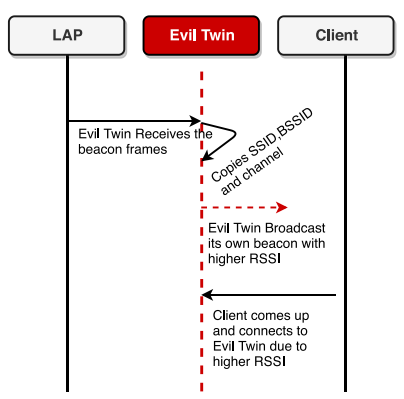
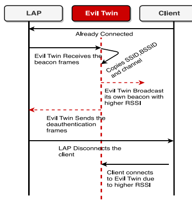

### Opis

U današnje vreme bežični internet  je najrasprostranjeniji izvor pristupa internetu, bilo u kućama, stanovima, poslovnim prostorima ili javnim hotspotovima. Samim tim on prestavlja veoma atraktivno polje za napad. Pretnja koja je prisutna, kao što je zlonamerni blizanac. Napadač može imitirati legitimnu tačku pristupa (LAP - Legitimate Access Point), jer je lako falsifikovati naziv mreže (**SSID**) i **MAC** adresu (BSSID) legitimne tačke pristupa. Takva lažna tačka pristupa koja tvrdi da je legitimna poznata je kao zlonamerni blizanac (evil twin). Hotspot i softverske sposobnosti na klijentskim uređajima (laptop/mobilni) dovoljni su za pokretanje napada zlonamernog blizanca. Ako se klijenti povežu s zlonamernim blizancem, on može biti "čovek-u-sredini" između LAP-a i klijenata i prisluškivati ili manipulisati osetljivim podacima klijenata \[1\]. Tačka pristupa je zapravno javni ili bilo koji drugi ruter koji omogućava korisnicima pristup internetu.

**SSID** je skraćenica za identifikator servisnog seta (service set identifier), koji je važan identifikator za bežične mreže. Bitno je napomenuti da je SSID naziv koji se dodeljuje Wi-Fi mreži prilikom postavljanja rutera. Neki primeri SSID-ova mogu uključivati "Familija Nikolić" ili "FTN WiFi".

**MAC** adresa (Media Access Control adresa) je identifikator hardvera koji jedinstveno identifikuje svaki uređaj u mreži. Uglavnom je dodeljuje proizvođač. Često se nalaze na mrežnom interfejsnom kontroleru (NIC kartici) uređaja.

### Evil Twin

U WiFi mreži, tačka pristupa (AP) periodično emituje svoje **beacon frame**-ove kako bi pokazala svoje prisustvo u bežičnom okruženju. Klijent otkriva tačke pristupa slušajući njih kako se oglašavaju. Oni sami po sebi ne mogu biti šifrovani. U suprotnom, klijent ne može da se poveže s tačkom pristupa. Kao rezultat toga, ova ranjivost pruža odličnu priliku napadačima da prodiru u WiFi mrežu i izvode napade poput zlonamernog blizanca.

**Zlonamerni blizanac** (evil twin) je zlonamerna replika tačke pristupa (LAP) pokrenuta od strane napadača, koja oponaša identitet LAP-a u mreži, kao što je prikazano na slici ispod. Napadač beacon frejmove LAP-a i lako izvlači SSID i BSSID, jer oniokviri nisu šifrovani. Zatim napadač kreira sličnu tačku pristupa falsifikujući BSSID i SSID LAP-a, kao što je prikazano na slici ispod. Napad postaje uspešan jer klijenti koji slušaju beacon frejmove ne mogu razlikovati identitet LAP-a i zlonamernog blizanca, pretpostavljajući da su oba legitimna AP-a [1].

**Beacon frame** je vrsta upravljačkog okvira u IEEE 802.11 WLAN (bežičnim lokalnim mrežama). Sadrži informacije o mreži. Beacon okviri se periodično šalju; služe da obaveste o prisustvu bežične lokalne mreže i pruže vremenski signal za sinhronizaciju komunikacije sa uređajima koji koriste mrežu [2].

*Slika 2. EvilTwin lansiran od strane napadača*

*Slika 3. EvilTwin imitira legitimnu tačku pristupa(AP)*

### Napad

Postoje dve metode Evil Twin napada: 

- **Pasivni Evil Twin napad:** napadač pokreće zlonamernog blizanca i povećava jačinu signala hotspot-a zlonamernog blizanca. Na taj način, svaki put kada se bilo koji klijent pokuša povezati, povezuje se sa zlonamernim blizancem, prikazano na slici 4.

- **Aktivni Evil Twin napad:** Zlonamerni blizanac cilja klijente koji su već povezani sa legitimnom tačkom pristupa (LAP) izvođenjem napada deautentifikacije preko LAP-a. Zbog toga, klijent se odjavljuje iz veze s LAP-om i povezuje se sa zlonamernim blizancem, kako je prikazano na slici 5.

*Slika 4. EvilTwin čeka žrtve (pasivni napad)*

*Slika 5. EvilTwin aktivno odjavljuje korisnike (aktivni napad)*

Na javnim WiFi mrežama, neki od dobro poznatih napada uključuju pasivno slušanje i phishing. Zlonamerni blizanac uvodi znatno ozbiljnije sigurnosne pretnje u odnosu na pasivno praćenje kanala jer: 1) zlonamerni blizanac je sposoban preusmeriti komunikaciju WiFi klijenata; 2) sposoban je izazvati zasićenje kanala; 3) može odlagati komunikaciju s klijentom. Phishing napadi na WiFi mrežama uglavnom su povezani sa MAC slojem. Napadi ribarenja koje izvode WiFi klijenti lako se mogu uočiti. Stoga, ozbiljniji napadi ribarenja u WiFi mrežama zahtevaju iskorišćavanje tačaka pristupa. Napadač može iskoristiti tačke pristupa da izvede ribarenje na sledeće načine: 1) kompromitovanjem LAP-a ili 2) pokretanjem zlonamernog blizanca. Kompromitovanje tačke pristupa u WiFi mrežama je teško, ali pokretanje zlonamernog blizanca je jednostavno. Stoga je napad zlonamernog blizanca lako izvesti, unoseći ozbiljne pretnje, i teško ga je detektovati.

### Mitigacije

Predložen EvilScout sistem.

\[1\] [EvilScout: Detection and Mitigation of Evil Twin Attack in SDN Enabled WiFi Pragati Shrivastava , Mohd Saalim Jamal , and Kotaro Kataoka](https://sci-hub.se/10.1109/tnsm.2020.2972774)

[2] [802.11 Mgmt : Beacon Frame | mrn-cciew](https://mrncciew.com/2014/10/08/802-11-mgmt-beacon-frame/)

