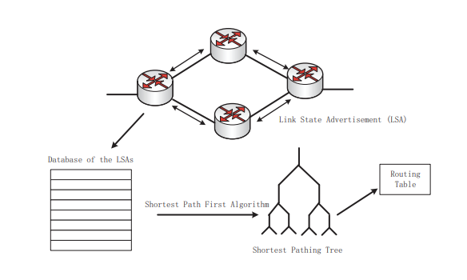
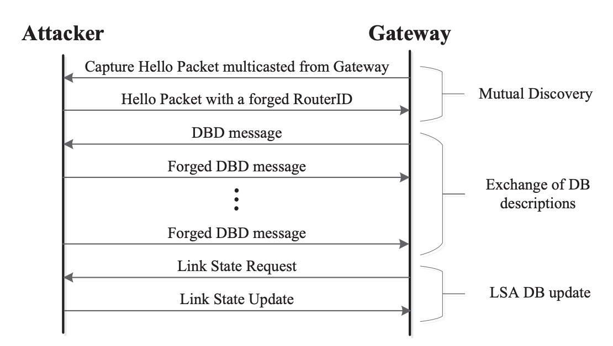
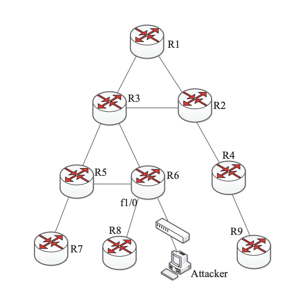
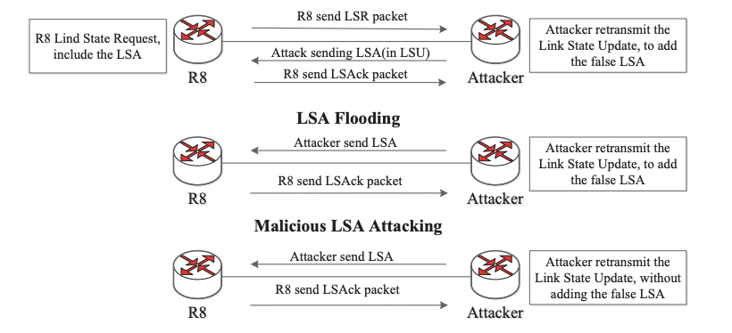

# LSA Falsifikovanje

Protokol rutiranja određuje kako ruteri komuniciraju jedni sa drugima, šireći informacije koje im omogućavaju biranje rute između bilo koja dva čvora na računarskoj mreži [1]. Internet koristi dve klase dinamičkih protokola za rutiranje:

1.  Distance-vector routing protocol (protokol za rutiranje vektora udaljenosti) koji manipuliše vektorima rastojanja čvorova unutar mreže.
2.  Link-state routing protocol (protokol za rutiranje stanja veza) koji obavještava sve čvorove kada mreža promijeni topologiju [1].

> _Topologija mreže_ određuje raspored mrežnih uređaja.

U daljem nastavku teksta obradiće se LSA falsifikovanje kao najčešći napad na protokol za rutiranje stanja veza u kojem napadač propagira lažni LSA sa lažnim informacijama o vezi u ime rutera unutar same mreže. Napad se može izvršiti u dvije varijante, koje će biti opisana u nastavku dokumenta:

1.  Adjacency spoofing attack
2.  Single path injection attack

## OSPF protokol

Open Shortest Path First (OSPF) je jedan od najčešće korišćenih protokola za rutiranje. Predstavnik je protokol za rutiranje stanja veza, što znači da ruteri razmjenjuju informacije o topologiji sa svojim najbližim susjedima. Glavna odgovornost OSPF protokola za rutiranje je da omogući svim ruterima unutar autonomnog sistema mreže da naprave svoje tabele rutiranja i ažuriraju ih kada dođe do promjene topologije pomenutog sistema [2].

## Tabela rutiranja

Tabele rutiranja su neophodne u rutiranju jer održavaju mapu povezanih mreža, koja osigurava da je proces prosljeđivanja paketa što efikasniji. Bez prisustva tabela rutiranja, ruteri ne bi imali pojma kako da pakete pošalju do ciljanih odredišta. Cijeli proces prosleđivanja bi bio zamoran i dugotrajan. Može se posmatrati kao baza podataka koja čuva lokaciju rutera na osnovu njihovih IP adresa [7].

**Formiranje tabele rutiranja**
Unutar mreže svaki čvor konstruiše mapu mreže
povezanosti, u obliku grafikona, koji pokazuje kako su čvorovi
međusobno povezani. Kako bi čvor otkrio svoje susjedne rutere, pomoću OSPF protokola prvo se šalju „zdravo paketi“. Postoje tri komponente u zaglavlju zdravo paketa koje čuvaju informacije o statusu rutera:

- Hello interval - označava koliko često pošiljalac treba da ponovo šalje svoje hello pakete;
- Ruter dead interval - govori koliko je vremena potrebno da se proglasi nedostupan ruter;
- Neighbor list - opisuje susjede koje je pošiljalac već upoznao;

Kada se susjedni ruter pronađe preko protokola, pošiljalac prolazi kroz „proces razmjene baze podataka“ da bi sinhronizovao svoju bazu podataka. Zatim se informacije o lokalnim susjedima pošiljaoca sastavljaju u listu svih veza ka susjednim ruterima LSA (Link State Advertisement) [3], te emituju preko pouzdane inteligentne flooding šeme [4] svim ostalim ruterima.

Kada svi ruteri imaju ažuriranu bazu podataka, svaki ruter može da koristi Dijkstrin algoritam [5] za izračunavanje stabla najkraćeg puta sa drugim ruterima, time formira potpunu sliku rutiranja u mreži, koja se drugačije naziva tabela rutiranja prikazane na slici ispod.

 

## Ranjivosti

Neke ranjivosti koje se mogu uočiti kroz stvaranje tabele rutiranja i djelovanja OSPF protokola, koje napadači uveliko iskorištavaju prilikom svojih napada jesu:

1.  OSPF protokol smatra da su dve instance LSA identične ako imaju iste vrijednosti u sljedeća tri polja: Sekuence Number, Checksum i Age. Ključna stvar je da protokol smatra da su ova dva LSA ista čak i kada su stvarne veze različite. Adjacency Spoofing napad iskorištava ovu ranjivost oglašavanjem lažnog LSA koji izgleda identičan budućem LSA. [1]
2.  Ruter ne provjerava jednakost primljenog polja ID stanja veze i polja rutera za oglašavanje.
3.  . Kada se primi lažni LSA sa poljem Advertising Router koji je jednak ID trenutnog rutera moglo bi se zaobići neki bezbjednosti mehanizmi koje OSPF nalaže
4.  Tokom faze izračunavanja tabele rutiranja, ruterovi LSA-ovi se traže u bazi podataka koristeći samo polje ID stanja veze [6].

## Opisani slučajevi napada

**Adjacency Spoofing napad**

Gateway je uređaj za rutiranje koji propušta saobraćaj između različitih podmreža i mreža, pa je samim tim doprinos ruteru i OSPF protokolu za dinamičko otkrivanje susjeda pomoću zdravo paketa. Kada se napadač poveže sa mrežnim prolazom (gateway) u istoj podmreži, on prvo hvata zdravo paket i time dobija parametre. Pomoću tih parametara napadač pravi svoj zdravo paket. Gateway prima taj paket, smatrajući da je napadačev ruter standardni susjedni ruter i njemu potom šalje poruku opisa baze podataka (DBD), time razmjenjuju svoje liste veza sa ostalim ruterima (LSA). Napadač ovim dobija najkraće puteve do ostalih članova mreže, te svojim LSA-om ubacuje maliciozni kod. Gateway primivši taj lažni LSA od napadača, preplavljuje tim čitavu mrežu. Ostali ruteri ažuriraju svoje LSA-ove i time se i oni zarazuju lažnim rutama. Napad je slikovito prikazan na slici ispod.

 

**Single Path Injection Attack**

Single Path Injection napad želi da ubaci lažni LSA preko srednjeg „odskočnog rutera“ do određenog „zagađenog rutera“. Napadač može poslati lažni LSA sa hosta na zagađen ruter R8 preko rutera odskočne daske R6. Izvorna IP adresa u ovom lažnom LSA je postavljena na adresu f1/0, a vrijednost ID-a je postavljena na ID R6, prikazanog na slici ispod. Na ovaj način, zagađeni ruter R8 vjeruje da je ovaj lažni LSA došao iz rutera R6. R8 je prvi ruter koji čuva lažni LSA u svojoj bazi podataka o stanju veze i šalje potvrdu stanja veze svim ostalim ruterima u OSPF mrežama.

 

Slika ispod prikazuje tri situacije slanja paketa ažuriranja stanja veze sa LSA. Prve dvije situacije prikazuju normalne interaktivne procese u fazi uspostavljanja susjedne veze i fazi LSA prenosa. Posljednji je interaktivni proces između napadača i zagađenog rutera prilikom slanja lažnog LSA.

 

U normalnoj fazi, ruter šalje LSA drugim ruterima, potom ubacuje LSA u svoju listu retransmisije stanja lokalne veze (lista kreirana za prenos LSA-ova), a zatim čeka potvrdu stanja veze u datom vremenskom intervalu. Ako nijedna potvrda stanja veze nije poslata pre isteka vremena, ruter ponovo emituje LSA. U suprotnom, ruter potvrđuje LSA i briše LSA sa liste retransmisije stanja lokalne veze.

Ovaj napad je napredniji jer u potpunosti može zaobići Fight-back mitigaciju. Ova mitigacija se neće pokrenuti samo ako žrtva ruter ne oglašava da se treba ispraviti LSA, a to se postiže tako što primljeni LSA mora biti identičan njegovom posljednjem važećem LSA. Provjera identičnosti je opisana u stavci jedan u paragrafu Ranjivosti.

Nadovezujući se na prethodne paragrafe, kada napadač pošalje lažni LSA sa ID-om rutera odskočne daske, lista retransmisije stanja veze rutera odskočne daske neće sadržati nikakve informacije o ovom lažnom LSA. Stoga, kada ruter odskočne daske primi potvrdu o stanju veze koja sadrži lažni LSA od zagađenog rutera, on samo odbacuje ovu potvrdu direktno i ne pokreće mehanizam Fight-back.

U procedurama napada ubrizgavanjem jedne putanje, možemo zaključiti da se ovaj napad dešava samo kada postoji jedan prenosni put između rutera odskočne daske i zagađenog rutera. Ukoliko topologija izgleda kao na slici 4, lako se napad može propagirati i na ostale rutete.

## Posljedice

Posljedice koje bi LSA ostavio na rutiranje:

- **Rutiranje biva nedosljedno**
  Falsifikovanje LSA može dovesti do nedosljednosti u informacijama o rutiranju preko rutera unutar OSPF mreže.

- **Neovlašćenog pristupa**
  Napadači mogu koristiti LSA falsifikovanje kao sredstvo za dobijanje neovlašćenog pristupa dijelovima mreže. Manipulišući LSA-ovima, oni bi mogli preusmjere saobraćaj kroz putanju koju kontrolišu ili da ugroze bezbjednost određenih segmenata mreže.

- **Izolacija i mrežno particionisanje**
  Ova fragmentacija može da izoluje segmente mreže jedan od drugog, ometajući komunikaciju.

- **Integritet i povjerljivost podataka**
  Falsifikovanje LSA može otkriti osjetljive podatke i učiniti mrežu podložnom neovlašćenom pristupu. Ovo može dovesti do presretanja saobraćaja, prisluškivanja ili čak man in the middle napada.

## Mitigacije

Mjere bezbjednosti koje su upakovane u sam OSPF protokol su:

1.  Provjera autentičnosti paketa koji se ogleda u tome da svaki OSPF paket treba da bude autentifikovan na tri načina: NULL autentifikacijom, jednostavnom provjerom identiteta lozinke i kriptografskom autentifikacijom. U ove tri šeme autentifikacije, samo kriptografska autentifikacija može da obezbijedi zaštitu integriteta zasnovanu na kriptografskom algoritmu. Svi ruteri imaju zajednički tajni ključ povezan sa zajedničkom mrežom/podmrežom u kriptografskoj autentifikaciji. Za svaki paket OSPF protokola, ovaj ključ se koristi za generisanje/verifikaciju sažetka poruke sa MD5 heš funkcijom. Zbog nedostatka definisanog mehanizma za upravljanje tajnim ključevima, mrežni operater mora ručno da konfiguriše tajne na svakom ruteru
2.  „Fight-back” mehanizam: OSPF protokol primjenjuje sigurnosni mehanizam, nazvan kao „Fight-back” mehanizam da otkrije i poništi lažne LSA preplavljene u mrežama na osnovu njegovog dizajna otpornosti na greške. Kada ruter primi instancu sopstvenog LSA, ali noviju od posljednje instance koju je nastao, ruter odmah oglašava noviju instancu LSA koja poništava lažnu. OSPF protokol takođe ima mehanizam floodinga koji osigurava da svi ruteri u mrežama održavaju istu topološku bazu podataka. Prema tome, lažni LSA koji je reklamirao napadač će na kraju biti poslat ruteru žrtve.

Moguće mjera za ublažavanje pomenutih ranjivosti:

1. Provjera jednakosti polje identifikatora stanja veze rutera koji je primio LSA i polja identifikatora ruter koji se zaista trebao oglasiti. Ukoliko nisu ova dva polja ista, dobijeni LSA treba odbaciti.
2. Fight-back mehanizam će se pokrenuti ako se primi lažni LSA koji ima ID trenutnog rutera u polju oglašavačkog rutera ili u polju ID stanja veze.
3. Tokom faze izračunavanja tabele rutiranja, ruterovi LSO-ovi se traže koristeći njihov puni identifikator [6].

## Reference

\[1\] [Yubo SONG, Shang GAO, Aiqun HU, Bin XIAO. Novel Attacks in OSPF Networks to Poison Routing Table](https://www4.comp.polyu.edu.hk/~shanggao/publications/Novel_Attacks_in_OSPF_Networks_to_Poison_Routing_Table.pdf)

\[2\][Bahaa Al-Musawi, Philip Branch, Mohammed Falih Hassan, Shiva Raj Pokhrel. Identifying OSPF LSA falsification attacks through non-linear analysis](https://www.sciencedirect.com/science/article/abs/pii/S1389128619310333#preview-section-references)

\[3\][Brad Woodberg, Ralph Bonnell. Configuring Juniper Networks NetScreen & SSG Firewalls, Chapter 7. Routing](https://www.sciencedirect.com/topics/computer-science/link-state-advertisement#:~:text=Link%20State%20Advertisements%20%28LSAs%29%20are,BDR%20routers%20to%20announce%20changes.)

\[4\][Katie Terrell Hanna. Flooding (network)](https://www.techtarget.com/searchnetworking/definition/flooding#:~:text=In%20a%20computer%20network,%20flooding,node%20in%20a%20large%20network.)

\[5\] [M. Noto, H.Sato A method for the shortest path search by extended Dijkstra algorithm ](https://ieeexplore.ieee.org/abstract/document/886462)

\[6\][Gabi Nakibly, Adi Sosnovich, Eitan Menahem, Ariel Waizel, Yuval Elovici. OSPF Vulnerability to Persistent Poisoning Attacks: A Systematic Analysis](https://csaws.cs.technion.ac.il/~gnakibly/papers/ACSAC14.pdf)

[7] [Understanding Routing Table](https://www.baeldung.com/cs/routing-table-entry)
