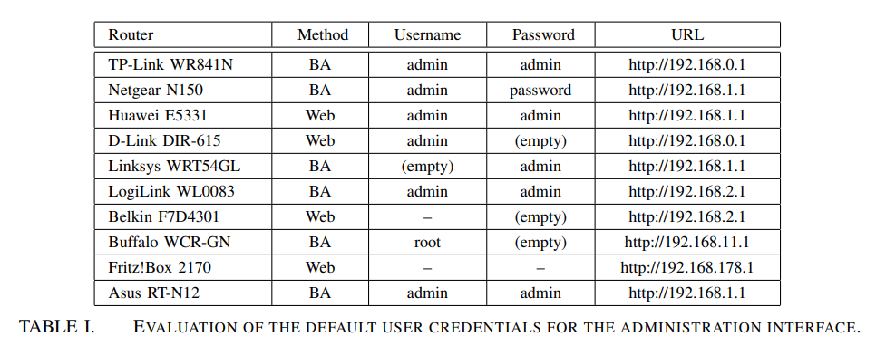

## Napad preko direktne povezanosti

Ovaj napad je prouzrokovan specificnim posledicama i zahteva da se napadač poveže na ruter direktno, putem ethernet kabla, ili pak putem WiFi tehnologije. Obično ga vrši neka osoba koja je insider, ima pristup etherenet konekciji, ili zna WiFi lozinku.

On se deli na tri slučaja:

- Napadač ima pristup ethernet kablu
- Napadač zna WiFi lozinku
- Napadač fizički ima pristup ruteru

&nbsp;

## Napadač ima pristup ethernet kablu

Postoje različite tehnike koje maliciozni pojedinci mogu koristiti kako bi ugrozili Ethernet priključke ili mreže. Evo nekoliko primera:

1. **Fizički pristup:** Ako napadač dobije fizički pristup Ethernet priključku, može direktno povezati svoj uređaj sa mrežom, zaobilazeći bilo koje bezbednosne mere koje su na snazi. Ovo se može postići ubadanjem uređaja u neosiguran ili nepažljivo nadgledan priključak.

2. **ARP Spoofing/ARP Poisoning:** ARP spoofing je tehnika gde napadač šalje lažne ARP poruke kako bi povezao MAC adresu svog uređaja sa IP adresom nekog drugog uređaja na mreži. Time mogu presresti i manipulisati saobraćajem između uređaja, potencijalno sticanjem neovlašćenog pristupa.

3. **VLAN Hopping:** VLAN hopping uključuje iskorišćavanje netačnih konfiguracija ili ranjivosti u implementaciji VLAN-ova kako bi se stekao neovlašćen pristup drugom VLAN-u. Manipulacijom VLAN oznaka ili iskorišćavanjem slabe kontrole pristupa, napadač može zaobići segmentaciju mreže i pristupiti osetljivim informacijama.

4. **Prisluškivanje mreže:** Hakeri mogu koristiti alate za prisluškivanje mreže kako bi uhvatili i analizirali saobraćaj koji prolazi kroz Ethernet priključak. Proučavanjem uhvaćenih podataka, mogu izvući osetljive informacije poput korisničkih imena, lozinki ili drugih nešifrovanih podataka.

5. **Umetanje malvera:** Ako napadač može pristupiti uređaju povezanom sa Ethernet priključkom, može pokušati ubaciti malver na taj uređaj. Ovo se može postići različitim metodama, kao što su phishing napadi, iskorišćavanje ranjivosti softvera ili tehnike socijalnog inženjeringa. \[1\] 

### Mitigacije

Stavljanje uređaja koji zaključava ethernet portove na ruteru, bili oni zauzeti ili ne.

Takođe i bolja kontrola pristupa otvorenim ethernet portovima.

## Napadač zna WiFi lozinku

Ako napadač zna WiFi lozinku, ili ako je WiFi mreža otvorena on može da kuša napade defaultnih kredencijala, istraživanja su pokazala da većina ljudi ne promeni defaultne kredencijale rutera prilikom njihove instalacije. 

Kod testiranih rutera se mogu uočiti defaultni kredencijali koji se ne razlikuju mnogo jedni od drugih i samim tim maliciozni korisnici mogu to veoma lako da iskoriste \[2\]. Ako im to pođe za rukom napadači su uspešno prešli jedan sloj odbrane, i otvaraju im se vrata raznim napadima:

-  Cross Site Scripting ([XSS](https://github.com/n-vojin/Zastita-tim7/blob/main/XSS.md))
-  Cross-Site Request Forgery (CSRF)
- [UI Redressing](https://github.com/n-vojin/Zastita-tim7/blob/main/UI%20Redressing.md)
  - Clickjacking
  - Tabjacking
- [Evil Twin](https://github.com/n-vojin/Zastita-tim7/blob/main/Napadi%20i%20odbrane/Evil%20Twin.md)

### Mitigacije

Menjaje defaultnih kredencijala za logovanje na aplikativni softver od rutera.

Takođe stavljanje WiFi lozinke putem WPA2 ili nekih drugih ugrađenih protokola za zaštitu.

## Napadač fizički ima pristup ruteru

Kada napadač ima fizički pristup ruteru osim što ima mogućnost da uradi sve gore navedeno, može i da instalira uređaje za prisluškivanje saobraćaja i da time postande Man-in-the-middle.

Iako je WiFi mreža, i aplikativni softver predhodno zaštićen ne defaultim šiframa, napadač može da iskoristi dugme za resetovanje rutera, i time dobjia sve defaultne kredencijale i informacije, koje su i u većini slučajeva prikazane direktno na ruteru.

## Mitigacije

Bolja kontrola pristupa.

&nbsp;

## Reference

\[1\] https://www.quora.com/Is-it-possible-to-be-hacked-through-an-Ethernet-cable-like-being-hacked-with-a-USB

\[2\] [Owning Your Home Network: Router Security Revisited - Marcus Niemietz, Jorg Schwenk](https://arxiv.org/ftp/arxiv/papers/1506/1506.04112.pdf)
