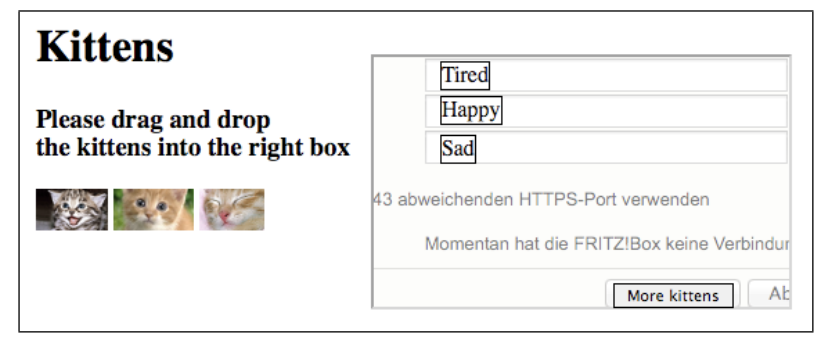
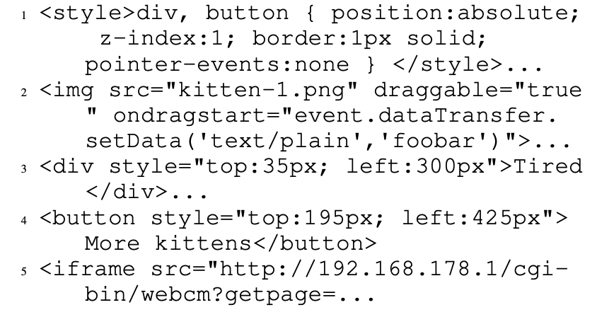

## UI Redressing

UI Redressing je tehnika napada za modifikovanje ponašanja i, opciono, izgleda napadnute web stranice. Cilj napadača je da dozvoli žrtvi da izvrši radnje koje je odredio napadač [1] . Ovaj dokument prikazuje dva različita napada za ispravljanje korisničkog interfejsa koji se mogu koristiti za iskorišćavanje web interfejsa rutera:

- Classic Clickjacking
- Tabjacking

**Classic Clickjacking**
Kod Clickjacking napada, napadač ubacuje svoju stranicu ili element unutar IFrame-a. IFrame je element koji učitava strukturu HTML dokumenta unutar web aplikacije [2] . Tim sadržajem, napadač namamljuje korisnike da kliknu na određen element.

**Tabjacking**
Korišćenjem objekta window.name moguće je postaviti i dobiti ime prozora, uključujući kartice pretraživača ili iskačuće prozore, tako da se može direktno adresirati preko hiperlinkova i formulara. Napadač može da ga koristi da manipuliše URL-om administrativnog interfejsa tako što će namamiti žrtvu da klikne na link zlonamjerne web stranice koju kontroliše napadač.

Tipičan scenario Tabjacking-a jeste da web stranica napadača sadrži “a” (link) element sa kodom

    <a target="router_interface" href="[//192.168.1.1]"> LINK </a>

Kada klikne na link element, otvara se stranica administrativnog interfejsa, gdje se potom mami žrtva da klikne na link maliciozne veb stranice. U tom linku se nalazi dio kod

    href="#"
    onclick="window.open('https://evil.com/','router_interface');
    return false;"

Tako povezan ruter interfejs i maliciozna stranica, omogućavaju krađu svih unesenih podataka. [1]

## Ranjivosti

Redressing korisničkog interfejsa je vrsta bezbjednosne ranjivosti na webu gdje napadač prekriva ili manipuliše elementima korisničkog interfejsa legitimnog web sajta da bi prevario korisnike da stupe u interakciju sa neželjenim sadržajem ili izvrše nenamjerne radnje.

## Opisan slučaj napada

Napadač mora da analizira da li postoje mogućnosti prepravljanja korisničkog interfejsa na ciljnom web interfejsu, jer želi da manipuliše udaljenim pristupom web stranice kako bi pristupio interfejsu administracije. Namera iza ove funkcionalnosti je da se može dozvoliti ljudima od poverenja da konfigurišu Internet ruter preko web pretraživača i stoga podržavaju vlasnika ili administratora rutera. Uspješan napad zahtjeva od žrtve da unese korisničko ime i dva puta lozinku u polja za unos teksta. Nakon popunjavanja polja, žrtva mora proslediti ulazne podatke klikom na dugme Pošalji. Ukratko, napadaču je potrebno da žrtva unese potrebne podatke i klikne na dugme Pošalji. Napadač može lako postići radnje žrtve koristeći tehnike prepravljanja korisničkog interfejsa zajedno sa društvenim inženjeringom.

Prvo, napadač mora da kreira web stranicu koja animira žrtvu da izvrši akcije prevlačenja i ispuštanja. Tačnije, napadač namami žrtvu da povuče napadačeve definisane elemente na napadačevu web stranicu. Takva web stranica može da se sastoji od teksta i HTML elemenata kao što su img i h1. Osim ovog scenarija napada, napadač takođe može pokušati da pronađe ranjivost ubrizgavanja koda na pouzdanoj i redovno posjećenoj web stranici.

 
Slika 1. Primjer stranica sa malicioznim elementima

Jedan od načina za napad na žrtvu prikazan je na slici 1. Postoje tri slike sa mačićima i tri kutije koje navode neka svojstva ovih slika. Drugo, korisnik će kliknuti na sliku mačića, prevući je i ispustiti izabrani element u jedan od tri okvira. Ove kutije su postavljene ispod nevidljivog iFrame-a koji učitava administrativni interfejs. U našem napadu, žrtva odlučuje kakav je efekat ovih radnji i klikne na dugme da dobije više informacija ili žrtva bira da vidi više mačića. Svaka slika ispušta vrednost foobar u tekstualno polje korišćenjem atributa draggable.

  Slika 2. Kod za izvršetak napada

Na slici 2 je prikazan kod za izvršetak napada. Koristimo CSS kod da izvršimo uspješan napad prepravljanja korisničkog interfejsa pomoću API-ja za prevlačenje i ispuštanje i iFrames-a. Prvi red sadrži većinu CSS koda koji se odnosi na div i button elemente. Postavljamo poziciju, koristimo z-indeks kao svojstvo da preklopimo iFrame sa adresiranim elementima i definišemo vrijednosti u tekstualna polja a ne u div elemente. Druga linija pokazuje kako se može napraviti slika mačića. Koristimo obrađivač događaja ondragstart sa tipom tekt/plain i vrednošću foobar. Ovo omogućava napadaču da koristi ovu vrijednost kao korisničko ime i lozinku za navigaciju kroz interfejs administracije nakon uspješnog napada. Štaviše, definišemo atribut koji se može prevući tako da ne ispuštamo ime slike ili putanju slike u polje za tekst. Samo foobar definisan od strane napadača se ispušta. Četvrti red sadrži naš element dugmeta sa pozicijom iznad dugmeta administrativnog interfejsa. Poslednje, ali ne i najmanje važno, je iFrame koji učitava web stranicu da bi kreirao daljinski pristup koristeći CSS kod, da bi je postavio pored teksta i slika mačića.

Kombinujući različite funkcije pretraživača kao što je API za prevlačenje i rukovanje događajima, napadač dobija automatski pristup web interfejsu tako što samo otme korisnika sa tri akcije prevlačenja i ispuštanja, kao i jednim klikom na dugme. Dakle, imamo kritičnu ranjivost sa srednjim naporom da dobijemo potpuni pristup interfejsu administracije i stoga da promenimo DNS [3] podešavanja, da ponovo pokrenemo uređaj ili da se instalira druga manipulisana verzija firmvera.

## Posljedice

Posljedice ovog tipa napada jesu:

- Neovlašćene radnje u ime korisnika
- Phishing attacks
- Širenje malicioznog koda
- Krađa osjetljivih informacija

## Mitigacije

Neki od načina prevencije ovog napada jesu:

1. **Client-side defenses** mehanizam koji sprečava da se web lokacija učita u IFrame.
2. **Using the X-Frame-Options header** bolji pristup za sprečavanje napada klikova je da se zamoli pregledač da blokira svaki pokušaj učitavanja web lokacije unutar IFrame-a. To se može učiniti slanjem HTTP zaglavlja Ks-Frame-Options.
3. **Using CSP** Glavni pretraživači podržavaju zaglavlje Ks-Frame-Options. Međutim, nikada nije standardizovan, tako da možda postoje pretraživači koji ga ne podržavaju. Alternativni standardni pristup za sprečavanje napada klikova je korišćenje posebnih direktiva politike bezbednosti sadržaja (CSP).
4. **Using cookie's sameSite origin** Ako je web aplikacija podložna klikovima zbog kolačića sesije, može se zaštititi korišćenjem istog svojstva kolačića sameSite. U ovom slučaju, odbrana se ne zasniva na kršenju ponašanja IFrame-a, već na sprečavanju da sesija bude važeća kada je web lokacija unutar IFrame-a [5].

## Reference

[1] [Marcus Niemietz, Jorg Schwenk. Owning Your Home Network: Router Security Revisited](https://arxiv.org/pdf/1506.04112.pdf)

[2] [Luqmanul M. What Is an iFrame?](https://www.hostinger.com/tutorials/what-is-iframe/)

[3] [[Ben Lutkevich, John Burke. Domain name system (DNS)](https://www.techtarget.com/searchnetworking/definition/domain-name-system)

[4] [[Andrea Chiarelli. Clickjacking Attacks and How to Prevent Them](https://auth0.com/blog/preventing-clickjacking-attacks/#Prevent-Clickjacking-Attacks)
