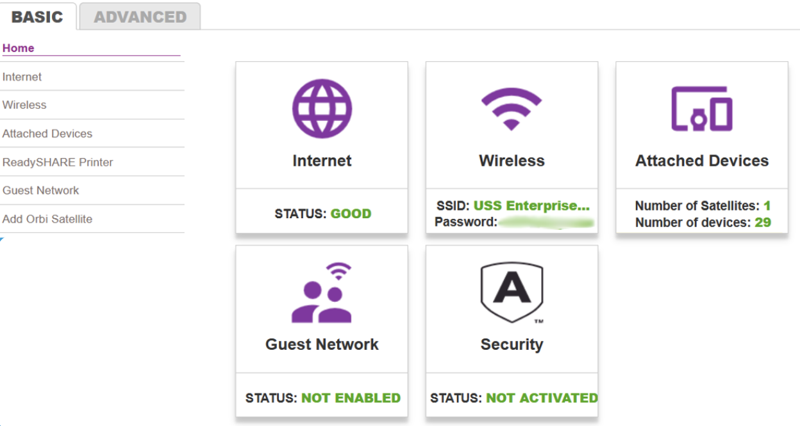
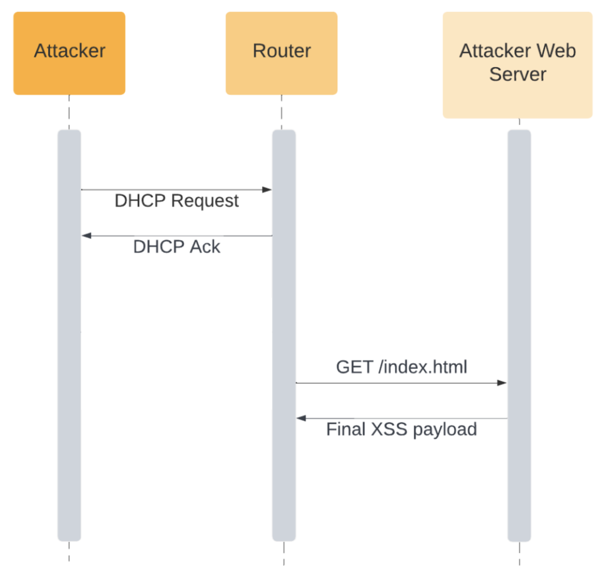

## XSS Napad

Ako pričamo uopšteno, Cross-Site Scripting (XSS) su vrsta injekcije, u kojoj se maliciozne skripte ubrizgavaju u web lokacije. Mane koje omogućavaju uspjehe ovih napada su prilično rasprostranjene i javljaju se svuda gdje web aplikacija koristi korisnički unos u okviru izlaza koji generiše bez validacije ili kodiranja. Napadač može da koristi XSS da pošalje zlonamjernu skriptu korisniku koji ništa ne sumnja. Pregledač (Web browser) krajnjeg korisnika nema načina da zna da skripti ne treba vjerovati i da će je izvršiti. Pošto misli da je skripta došla iz pouzdanog izvora, zlonamjerna skripta može da pristupi svim kolačićima, tokenima sesije ili drugim osetljivim informacijama koje čuva pregledač [1].

Skoro svi kućni ruteri obezbjeđuju administrativni interface zasnovan na Web-u preko kojeg korisnik može lako da upravlja ruterom. Korisnici se moraju autentifikovati na ruter prije nego što pristupe bilo kom interaktivnom dijelu web interface-a [2], što daje mogućnost napadačima da izvrše napad.

## Ruterov administrativni web interface

Ruter čuva sva podešavanja za kućnu Wifi mrežu. Da bi se nešto promijenilo na mreži, korisnik se prvo prijavljuje svojim ruter kredencijalima na Login stranici, koja se najčešće nalazi na 192.168.1.1. ili 192.168.1.0. IP adresi [3].

Time dobija pristup ruterovom softveru, poznatom još kao firmware, koji implementira svoj web interface za komunikaciju sa klijentima, čije se ranjivosti koriste za XSS napad. Odatle korisnik može preimenovati svoju mrežu, promijeniti lozinku, podesiti nivo bezbjednosti, te baratati nizom drugih opcija [3].

Izgled ruterovog administrativnog web interface-a sa svojim opcijama prikazan je na slici ispod.

U nastavku će se razmotriti ranjivosti i napadi na Belkin F7D4301 ruter [4].

## Ranjivosti

Najčešća ranjivost administrativnog web interface koja omogućava XSS napade jeste slab mehanizam validacije unosa, koji nije dovoljno strikto konfigurisan da blokira napade ubrizgavanjem koda.

Druga ranjivost omogućava udaljenim napadačima da ubace proizvoljnu web skriptu ili HTML preko imena hosta DHCP klijenta. DHCP klijent je Internet host koji koristi DHCP protokol za dobijanje konfiguracionih parametara kao što je IP adresa. DHCP protokol koji nalaže da serveri upravljaju skupom jedinstvenih IP adresa, kao i informacijama o parametrima konfiguracije klijenta [5].

## Opisani slučajevi napada

U ovom segmentu su opisana dva napada. Prvi napad kao primjer iskoristive ranjivosti slabe validacije, a drugi napad krši DHCP protokol i time napada ruter.

**XSS preko slabo validiranog tekstualnog polja**
Da bi napao korisnika preko XSS-a, napadač može da koristi datoteku koja bi omogućavala dodavanje virtuelnog servera uz pomoć HTTP POST zahteva. Ključna tačka ovog POST zahtjeva je mehanizam validacije unosa. Zbog toga je moguće ubaciti sačuvani XSS vektor preko jednog od tekstualnih polja, koje će uvijek biti prikazana kada korisnik posjeti web stranicu.
Dodatno uključivanje eksterne JavaScript datoteke pravi idealne preduslove za korišćenje alata za eksploataciju, time se omogućava povezivanje sa aplikacijom.

Sljedeći mogući koraci jesu:

1.  Koristiti mehanizme za prikupljanje informacija kako bi napadač dobio informacije vezane za instalirane žrtvine dodatke za izvođenje pojedinačnih eksploatacija pretraživača.
2.  Napad na korisnika tehnikama društvenog inženjeringa tako što se instalira Firefox/Chrome ekstenzija koja omogućava trajan ulazak u web pretraživač i na taj način napada sve posećene web lokacije.
3.  Otkrivanje mreže korišćenjem tehnika skeniranja portova ili implementiranim mrežnim napadima kao što je fingerprinting [6][7].

**XSS preko DHCP-a**
Drugi napad će iskoristiti ranjivost preko imena hosta DHCP klijenta. Većina rutera prikazaju listu klijenata povezanih na mrežu, zajedno sa njihovim povezanim imenima hostova u administrativnom dijelu web interface-a. Prikazana imena hostova su prijavljena u paketima DHCP zahtjeva koje klijent šalje ruteru, koje ruter prima tokom pregovaranja o DHCP IP adresi. Ruter takođe deluje kao DHCP server za lokalnu mrežu.
Ovo postavlja dva važna pitanja:

1.  Koji su očekivani karakteri u imenu hosta?
    _Ime (Host) je tekstualni niz do 24 znaka izvučen iz abecede (A-Z), cifara (0-9), znaka minus (-) i tačke (.). Tačke su dozvoljene samo kada služe za razgraničenje komponenti imena stilova domena. Nisu dozvoljeni prazni ili znakovi razmaka kao dio imena. Ne pravi se razlika između velikih i malih slova. Prvi znak mora biti alfa znak. Poslednji znak ne smije biti znak minus ili tačka.[8]_
2.  Da li su imena hostova potvrđena ili na bilo koji način izbačena?
    _Prateći ovu sintaksu i pravila, imena hostova bi trebala biti potvrđena, a ostatak izbačen?_

Šta bi se desilo ako bi se poslao DHCP zahtjev koji sadrži nevažeće ime hosta? Ruter to možda neće očekivati. Ako nevažeći znakovi nisu izbačeni, to može dovesti do bilo čega, od daljinskog izvršavanja koda, do pada rutera - do XSS-a.

Da bi se sproveo napad šalje se zahtjev, tako što se u ime hosta postavlja HTML code neispravnog imena. Ponovo se pokreće mrežna uslugu. Nevažeće ime hosta izazvalo je pad mrežne usluge. Kako nije izvršena nikakva provjera imena, različiti DHCP klijenti su potvrdili ime hosta [8].

Uvodimo Web server koji bi služio JavaScript code kojim predajemo HTML stranicu index.html. Na ovaj način umetnuto ime hosta može da bude kratak JavaScript snippet za preuzimanje i izvršenje stvarnog opterećenja na server [8].

Dijagram ovog napada je priložen ispod.

## Posljedice napada

Posljedice koje XSS napad na ruter nose jesu:

- **Neovlašćeni pristup web interface-a rutera**
  Napadači mogu da iskoriste ranjivosti da bi stekli kontrolu nad ruterom, omogućavajući im da mijenjaju podešavanja, preusmjeravaju saobraćaj ili čak zaključavaju legitimne administratore.

- **Krađa podataka**
  XSS napadi na rutere mogu dovesti do krađe osjetljivih informacija, kao što su kredencijali za prijavu, mrežne konfiguracije i drugi privatni podaci koji se čuvaju na ruteru.

- **DNS Spoofing**
  XSS napadi na rutere se mogu koristiti za izmjenu DNS podešavanja, što dovodi do DNS Spoofing-a. Ovo omogućava napadačima da preusmere korisnike na zlonamjerne web lokacije, što dovodi do Phishing napada ili distribucije malware.

## Mitigacije

Da bi se napad izbjegao potrebno se osvrnuti na ranjivosti. Prvu ranjivost bi mogli umanjiti tako što se uvodi bolja validacija i sanitarizacija. Validacija provjerava da li unos ispunjava skup kriterijuma. Sanitizacija modifikuje unos kako bi se osiguralo da je validan. Obično u kombinaciji ove dvije tehnike pružaju dubinsku odbranu svojoj aplikaciji. Na primjer, mogu se promijeniti svi jednostruki navodnici u nizu u dvostruke navodnike (sanitizujte), a zatim provjeriti da li su svi navodnici zaista promijenjeni u dvostruke navodnike (validira). Provjere validacije uključuju testiranje dužine, formata, opsega i dozvoljenih znakova. Oracle Database obezbjeđuje PL/SKL paket pod nazivom DBMS_ASSERT, koji sadrži funkcije koje se mogu koristiti za filtriranje i sanitarizaciju ulaznih nizova [9].

Studije za drugi napad pokazuju dobar primjer zašto standardni protokol nije bezbjedan mehanizam. Dok legitimni saobraćaj uvek treba da prati DHCP standard, ništa ne sprječava napadača da pošalje zlonamjerni saobraćaj koji namjerno uključuje nedozvoljene znakove [8]. Najbolji način da se zaštitite od ovih problema je provera na strani servera sa bijelim listama. Stavljanje na bijelu listu dozvoljava pristup samo određenim IP adresama koji se smatraju pouzdanim za pristup. Alternativa bijelim listama su crne liste. Takva lista može onemogućiti upotrebu specijalnih znakova tako što ih kodira, pa se ne mogu koristiti za izvršavanje zlonamjernog koda [6].

## Reference

[1] [Kirsten S. Cross Site Scripting (XSS)](https://owasp.org/www-community/attacks/xss/)

[2] [Craig Heffner, Derek Yap. Security Vulnerabilities in SOHO Routers](https://www.exploit-db.com/docs/english/13000-security-vulnerabilities-in-soho-routers.pdf)

[3] [Lance Whitney. How to Access and Change Your Wi-Fi Router's Settings](https://www.pcmag.com/how-to/how-to-access-your-wi-fi-routers-settings)

[4] [Belkin router documentation](https://www.belkin.com/my/support-article?articleNum=7994)

[5] [Alexander S. Gillis. DHCP (Dynamic Host Configuration Protocol)](https://www.techtarget.com/searchnetworking/definition/DHCP#:~:text=DHCP%20is%20a%20client-server,they%20connect%20to%20a%20network.)

[6] [Marcus Niemietz, Jorg Schwenk. Owning Your Home Network: Router Security Revisited](https://arxiv.org/pdf/1506.04112.pdf)

[7] [Fingerprinting](fingerprinting)

[8] [Malware News. XSS through DHCP: How Attackers Use Standards](https://www.pcmag.com/how-to/how-to-access-your-wi-fi-routers-settings)

[9] [What Is Input Validation and Sanitization?](https://download.oracle.com/oll/tutorials/SQLInjection/html/lesson1/les01_tm_ovw3.htm#:~:text=Validation%20checks%20if%20the%20input,depth%20defense%20to%20your%20application.)
